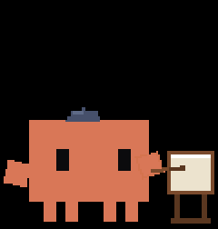
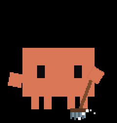
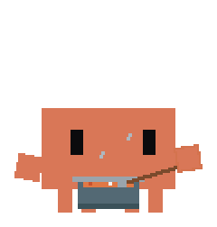
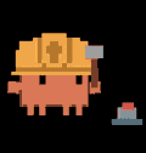
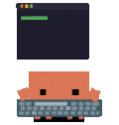

# CYD Claude Buddy

<p align="center">
  
  
  
  
  
</p>
<p align="center"><sub>Clawd hard at work — painting&nbsp;·&nbsp;sweeping&nbsp;·&nbsp;stirring&nbsp;·&nbsp;building&nbsp;·&nbsp;typing</sub></p>

A desk companion for Claude Code: the orange **Clawd** mascot on a **Cheap
Yellow Display** (ESP32) that mirrors your live Claude Code activity and usage
stats — driven entirely by Claude Code **hooks** over plain WiFi, with **no
Bluetooth and no always-on PC process**.

Clawd reacts to what Claude is doing (sleeping / ready / working, plus little
reactions when Claude needs you, finishes, or a session starts) while a stats
card tracks your usage: tokens today and all-time, tool calls, sessions, turns,
and the current session's duration. A tiny Python helper, invoked by Claude Code
hooks, reads each session's transcript and pushes a snapshot to the device.

Built for the **CYD** — the cheapest all-in-one ESP32 + screen + touch board.
The app sits on a thin HAL over `TFT_eSPI`, so it can also be adapted to other
ESP32 + TFT panels if you want — see [Adapting to other
boards](#adapting-to-other-boards).

> The official "Hardware Buddy" Bluetooth feature isn't exposed in the Claude
> desktop app build used here, so this project reproduces the experience over a
> self-hosted transport: a tiny HTTP server on the device plus Claude Code hooks
> on the PC.
>
> _Unofficial, personal fan project — **not affiliated with or endorsed by
> Anthropic.** "Clawd" is Anthropic's character; see [License &
> credits](#license--credits)._

---

## Contents

- [How it works](#how-it-works)
- [What it shows](#what-it-shows)
- [Hardware](#hardware) · [Adapting to other boards](#adapting-to-other-boards)
- [Build &amp; flash](#build--flash)
- [First-time setup](#first-time-setup)
- [Use it from any computer (no repo required)](#use-it-from-any-computer-no-repo-required)
- [On-device controls](#on-device-controls)
- [How usage is counted](#how-usage-is-counted)
- [Power use](#power-use)
- [Troubleshooting](#troubleshooting)
- [Repository layout](#repository-layout) · [License &amp; credits](#license--credits)

## How it works

```
Claude Code (PC)  ──hook──▶  buddy_hook.py  ──HTTP POST /event (LAN)──▶  device
  SessionStart / UserPromptSubmit / PreToolUse / PostToolUse /            (Clawd +
  Stop / SessionEnd / Notification                                        dashboard)
```

Two halves, joined only by a token-authenticated HTTP call on your LAN:

- **Device (firmware).** Boots, joins your WiFi (captive-portal on first run),
  and runs a small `WebServer`: `POST /event` (a JSON status+stats snapshot,
  authenticated with an `X-Buddy-Token` header) and `GET /` (health). It renders
  the Clawd GIF pack from on-board flash (LittleFS) with `AnimatedGIF`. It is
  single-threaded; by default it's purely a display. (An **optional** opt-in adds
  on-device *tap-to-approve* for a pending tool call — off unless you register the
  `PermissionRequest` hook; see [tools/HOOKS.md](tools/HOOKS.md).)
- **PC (`tools/buddy_hook.py`).** A single self-contained Python script that
  Claude Code runs on each hook event. It figures out what Claude is doing, reads
  the session transcript for the usage rollup, and `POST`s it to the device.
  Stats events are **non-blocking and fail open**: if the device is unreachable
  the error is swallowed, so they can never slow down or break a Claude session.
  (The optional approval hook briefly waits for your tap and also fails open — on
  a timeout or an unreachable device it falls back to Claude's normal prompt.)

The device is the source of truth for its own auth token; the PC just needs to
know the device's IP + token (see [setup](#first-time-setup)).

## What it shows

**Character states** (the mascot in the middle):

| State | When | Look |
|---|---|---|
| `sleep` (ASLEEP) | offline, or no activity yet | calm, dim |
| `idle` (READY) | connected, no work running | resting |
| `busy` (WORKING) | Claude is working | a rotating set of "working" clips + a whimsical verb ("Pondering…", "Brewing…") that changes in sync with the animation. Tool-aware: editing, running, reading, delegating… |
| `attention` (NEEDS YOU) | the turn was handed back to you — a **Notification**, or **Stop** with nothing to do next | sticky alert; the LED nudge escalates the longer it waits |
| `celebrate` (DONE!) | a turn just finished (**Stop**) | brief celebration |
| `heart` (HELLO) | a new session started (**SessionStart**) | brief hello |
| `error` (OOPS) | a tool reported an error | brief wince |
| `dizzy` | triple-tap the screen | easter egg |

`celebrate` / `heart` / `error` are short reactions that play for a few seconds
(and wake the screen if it's off), then fall back to the normal state.
`attention` ("Needs you") is sticky until Claude resumes — or until you tap
**Got it** on the screen to acknowledge it: the nudge stops escalating and won't
wake the screen again, while a calm amber pulse stays until the next time Claude
needs you. Acknowledging is local — it doesn't reply to Claude.

**Stats card** (bottom): two headline figures — **Today** and **Total** tokens —
over four compact counts: **Tools** (tool calls), **Turns** (assistant turns),
**Sess** (sessions today), **Time** (current session duration). The numbers
roll like an odometer when they change. A fuller, live-updating panel is under
long-press → **Settings → Stats** (adds project name, uptime, free heap, IP).

**Ambient cues.** The onboard RGB LED speaks a colour language — blue while
working (cooler/quicker as the session heats up), amber when it needs you
(escalating the longer it waits), red on error, green when a turn lands —
silenced by the **Quiet** setting (LED off / DND). Session intensity shows as
1–2 pips in the top bar.
**Usage gauges.** Set an optional daily token `"budget"` in `buddy.json` and the
stats-card divider becomes a usage gauge (coral → amber near the cap → red over).
Set `"limit5h"` and the home card instead shows a **rolling-5h quota bar** that
depletes as you spend, with a `~NN%`-left label (green → amber → red). ⚠️ It is
an *approximate* estimate summed from transcript token counts — Claude Code does
not expose your real plan limit to scripts, so treat it as directional, not
exact. The one authoritative signal a hook can catch is a usage-limit
**notification**: when Claude reports you're at/near the limit, the device flips
to a red **LIMIT** alert showing the message (and the real reset time, if given).

## Hardware

**Reference board — ESP32-2432S028R "Cheap Yellow Display" (CYD):**

- ESP32-WROOM-32, 4 MB flash, no PSRAM.
- Display: **ILI9341** 240×320 — the dual-USB "CYD2USB" unit is ILI9341, *not*
  ST7789 (feeding it the ST7789 driver gives a white screen).
- Resistive touch (XPT2046), onboard RGB LED, CH340 USB-serial.

It's the cheapest all-in-one board with a screen + touch (≈US$10), which is why
it's the default — but nothing about the app is CYD-specific.

### Adapting to other boards

CYD is the target, but the firmware is a thin HAL (`src/hal/`: display, touch,
led, storage) over `TFT_eSPI`, and everything above it — networking, hooks,
stats, the GIF character system — is hardware-independent. To run it on another
ESP32 + TFT:

- **Display:** set the matching `*_DRIVER` flag and pins in `platformio.ini`
  (`TFT_eSPI` supports ILI9341 / ST7789 / ST7735 / ILI9488 / …). The character
  region and UI lay themselves out from `display.width()/height()`.
- **Touch (optional):** adjust the XPT2046 pins in `src/hal/touch.cpp`, or stub
  `hal::Touch` — touch only drives the Settings menu and the easter egg.
- **LED (optional):** `src/hal/led.cpp`; safe to no-op if your board has none.
- **Flash / partition:** the Clawd pack needs ~0.6 MB of LittleFS — size the
  data partition to your board's flash.

The Clawd art is a plain GIF pack (`data/clawd/`, 120 px-wide, black background),
so you can drop in your own character without touching code.

## Build & flash

You need [PlatformIO](https://platformio.org/) (the `pio` CLI, or the VS Code
extension) and a USB cable to the board.

```bash
pio run -e cyd -t upload      # 1) firmware  -> app partition
pio run -e cyd -t uploadfs    # 2) GIF pack  -> LittleFS (data/clawd/)
```

Run both the first time (firmware *and* the filesystem image). After that,
re-flash only what changed — `upload` for code, `uploadfs` for new/edited GIFs.
The display driver is a build flag (`ILI9341_2_DRIVER` in `platformio.ini`); on a
different panel that shows a white or garbled image, switch to your controller's
driver/colour-order flags (e.g. `ST7789_DRIVER` + `TFT_RGB_ORDER=TFT_BGR`).

> **First build on a slow/blocked network.** The initial espressif32 toolchain +
> framework download can stall. If it does, fetch those archives out-of-band
> (e.g. a parallel, resumable downloader) and point PlatformIO at them with
> `platform_packages = …@file://…` in `platformio.ini`.

## First-time setup

1. **Flash** firmware + filesystem (above). On first boot the device shows
   **"Join WiFi hotspot: Claude-CYD-Setup"**.
2. **Join WiFi:** connect a phone/PC to the `Claude-CYD-Setup` hotspot, pick your
   network and enter its password (captive portal). The device reboots onto your
   WiFi and remembers it.
3. **Read its address + token:** the device shows its **IP** and a **token** on
   screen (also any time under long-press → **Settings → Stats**). The token is a
   random secret generated on the device.
4. **Tell your PC where the device is** — `~/.claude/buddy.json`:
   ```json
   { "ip": "<device ip>", "token": "<device token>" }
   ```
5. **Register the hooks** in `~/.claude/settings.json` so Claude Code drives the
   device. Full snippet + explanation: **[tools/HOOKS.md](tools/HOOKS.md)**.

That's it — start a Claude Code session and Clawd should wake up.

## Use it from any computer (no repo required)

**The flashed device is fully standalone.** Firmware and the animation pack live
in its own flash; it needs no PC, no repo, and no cloud — it just boots, joins
your WiFi, and waits for events. Any computer on the network can then drive it.

To drive it from a machine that **doesn't have this repository**, you only need
the **one** self-contained helper file — `buddy_hook.py` depends on nothing but
the Python 3 standard library and reads only `~/.claude/buddy.json` /
`~/.claude/buddy_tokens.json` (never the repo). So:

1. **Copy the single file** `tools/buddy_hook.py` to that machine — a good
   repo-independent home is `~/.claude/buddy_hook.py`.
2. **Create `~/.claude/buddy.json`** with the device `ip` + `token` (from the
   device's Settings → Stats).
3. **Add the hooks** to that machine's `~/.claude/settings.json`, with the
   command pointing at wherever you put the file, e.g.
   `python "~/.claude/buddy_hook.py"` (see [tools/HOOKS.md](tools/HOOKS.md) for
   the full block).

Requirements: **Python 3 on `PATH`**, and the machine must be able to **reach the
device** (same WiFi is simplest; off-network works via a mesh VPN such as
Tailscale with a subnet router advertising the device's LAN). `buddy_tokens.json`
is created automatically on first run.

Each machine keeps its **own** counts (`buddy_tokens.json` is per-machine, not
merged); if two machines push at once, the device shows whichever pushed last.

## On-device controls

- **Tap** while asleep — wake the screen.
- **Tap "Got it"** on the *Needs you* screen — acknowledge the nudge so it stops
  escalating and won't wake the screen again (a fresh turn re-arms it).
- **Triple-tap** — `dizzy` easter egg.
- **Long-press (~1 s)** — open **Settings**: **Stats** (full live panel),
  **Quiet** (one button, three steps you tap through — **Off** → **LED off**
  (silence the RGB LED, screen still wakes) → **DND** (LED off *and* the screen
  never auto-wakes, only your touch does)), **Brightness** (cycle the backlight
  100 / 70 / 40 %), **Recalibrate** (3-point touch calibration; times out safely
  if you walk away), **WiFi setup** (re-open the captive portal — keeps the saved
  password unless you enter a new network), **Power off** (deep sleep — screen,
  LED and WiFi off; tap the screen or press the board's **RST** button to turn it
  back on), **Close**. Quiet level and brightness persist across reboots.
- Auto **screen-off after 30 s** of calm; a touch or new Claude activity wakes it.

## How usage is counted

`buddy_hook.py` reads the current session's transcript and rolls up the day:

- **Tokens** = `input + output + cache_creation`. It deliberately **excludes
  `cache_read`** — that's the cached context re-read on *every* turn, which on a
  long session is ~95%+ of the raw token throughput and would balloon "today" to
  absurd numbers without reflecting real use.
- Assistant messages are **de-duplicated by id** (the transcript re-logs a
  message several times as it streams), so tokens / turns / tool-calls aren't
  double-counted.
- **Today** counts persist in `~/.claude/buddy_tokens.json` and reset at local
  midnight; the previous day rolls into the **all-time** total. A session that
  spans midnight isn't double-counted.

## Power use

The main saver is the **30 s auto screen-off**: the backlight (by far the
largest draw) and the LED switch off when idle, and a touch or new Claude
activity wakes it instantly — with no change to how the animation looks when it's
on. While the screen is off the CPU also drops from 240 → **80 MHz** (the
WiFi-safe minimum) to trim idle draw, then jumps back to full speed on wake. The
WiFi radio is deliberately kept **awake** (no modem-sleep): on this hardware the
radio power-save modes caused intermittent disconnects, and a steady link matters
more than the small idle saving.

For a true off, **Settings → Power off** puts the device into deep sleep
(screen, LED and WiFi all off, ~microamps). It wakes — and cold-boots back into
the dashboard — on a screen tap or a press of the board's **RST** button.

## Troubleshooting

- **White / garbled screen** — wrong display driver. The CYD2USB unit is
  **ILI9341**, not ST7789; check the `*_DRIVER` flag in `platformio.ini`.
- **Stuck on "Join WiFi hotspot"** — connect to `Claude-CYD-Setup` and complete
  the captive portal; re-open it later via Settings → WiFi setup.
- **Numbers never update** — the device shows what it last received. Check
  `buddy.json` (ip/token match the device), that the hooks are registered, that
  Python 3 is on `PATH`, and that the PC can reach the device IP.
- **IP changed** — DHCP gave the device a new address; update `ip` in
  `buddy.json` (a static DHCP lease avoids this).

## Repository layout

```
src/            firmware: hal/ (display, touch, led, storage), net/ (server),
                render/ (Clawd GIF); ble/ is shelved (excluded from the build)
data/clawd/     Clawd GIF character pack (flashed as the LittleFS image)
assets/         README preview GIFs
tools/          buddy_hook.py + HOOKS.md (the single-file PC helper + setup)
docs/           design notes
platformio.ini  build configuration
```

## License & credits

- **Code & tooling** (firmware + `tools/buddy_hook.py`): **MIT** — see
  [LICENSE](LICENSE). © 2026 Qiankang Wang.
- **Clawd character art** (`data/clawd/` and `assets/`): **not MIT.** "Clawd" is
  the property of **Anthropic, PBC**; all rights reserved. The pixel sprites are
  adapted from [rullerzhou-afk/clawd-on-desk](https://github.com/rullerzhou-afk/clawd-on-desk)
  (source code AGPL-3.0; artwork all-rights-reserved). Swap in your own
  black-background GIF pack to redistribute the project freely.
- **Concept & event model:** inspired by Anthropic's maker reference
  [claude-desktop-buddy](https://github.com/anthropics/claude-desktop-buddy)
  (MIT), reproduced here over WiFi + Claude Code hooks instead of Bluetooth.
- **CYD pinouts & community:** [witnessmenow/ESP32-Cheap-Yellow-Display](https://github.com/witnessmenow/ESP32-Cheap-Yellow-Display) (MIT).

> **Disclaimer.** This is an unofficial, personal fan project. It is **not
> affiliated with, sponsored by, or endorsed by Anthropic.** "Claude" and
> "Clawd" are trademarks/IP of Anthropic, PBC, used here only to interoperate
> with Claude Code for a non-commercial maker build.
