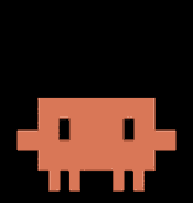
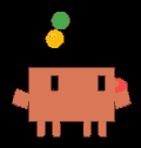
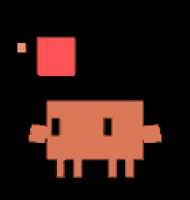
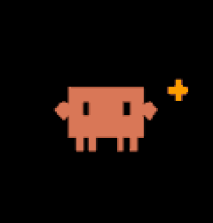

# CYD Claude Buddy

<p align="center">
  
  
  
  
  
</p>
<p align="center"><sub>ready&nbsp;·&nbsp;working&nbsp;·&nbsp;celebrate&nbsp;·&nbsp;dizzy&nbsp;·&nbsp;heart</sub></p>

A desk companion for Claude Code: the orange **Clawd** mascot on a **Cheap
Yellow Display** (ESP32) that mirrors your live Claude Code activity and usage
stats — driven entirely by Claude Code hooks over plain WiFi, with **no
Bluetooth and no always-on PC process**.

Built for the **CYD** — the cheapest all-in-one ESP32 + screen + touch board.
The app sits on a thin HAL over `TFT_eSPI`, so it can also be adapted to other
ESP32 + TFT panels if you want — see [Adapting to other
boards](#adapting-to-other-boards).

Clawd reacts to what Claude is doing (sleeping / ready / working) while a stats
card tracks your usage: tokens today and all-time, tool calls, sessions, turns,
and the current session's duration. A small Python helper, invoked by Claude
Code hooks, reads each session's transcript and pushes a snapshot to the device.

> The official "Hardware Buddy" Bluetooth feature is not exposed in the Claude
> desktop app build used here, so this project reproduces the experience over a
> self-hosted transport: a tiny HTTP server on the device plus Claude Code hooks
> on the PC.

## Features

- **Animated Clawd mascot** with states `sleep` · `ready` (idle) · `working`
  (busy) · `dizzy` (triple-tap easter egg), plus event reactions — `attention`
  when Claude needs you, `celebrate` when a turn finishes, `heart` on a new
  session. A whimsical activity verb rotates in sync with the animation while busy.
- **Live stats dashboard** — tokens today and all-time (`k`/`M`), tool calls,
  sessions, conversation turns, and session duration; the detail panel updates live.
- **Settings** (long-press): full Stats panel, touch recalibration, WiFi
  reconfigure (keeps the saved password).
- **Captive-portal WiFi setup**; token-authenticated HTTP on the LAN.
- 30 s auto screen-off; a touch or new activity wakes it.

## How it works

```
Claude Code (PC)  --hook-->  buddy_hook.py  --HTTP / LAN-->  device
  SessionStart / PreToolUse / Stop / …          POST /event  ->  dashboard
```

- **Device** — `WiFiManager` captive portal + a `WebServer` (`POST /event`,
  `X-Buddy-Token` auth) + `AnimatedGIF` rendering the Clawd pack from LittleFS.
  Single-threaded; no on-device approval.
- **PC** — `tools/buddy_hook.py`, invoked by Claude Code hooks, computes the
  usage rollup from the session transcript and posts it. All events are
  non-blocking and fail open (a device/network error is swallowed, so it can
  never slow Claude down).

## Hardware

**Reference board — ESP32-2432S028R "Cheap Yellow Display" (CYD):**

- ESP32-WROOM-32, 4 MB flash, no PSRAM.
- Display: **ILI9341** 240×320 — the dual-USB "CYD2USB" unit is ILI9341, *not*
  ST7789 (feeding it the ST7789 driver gives a white screen).
- Resistive touch (XPT2046), onboard RGB LED, CH340 USB-serial.

### Adapting to other boards

CYD is the target, but the firmware is a thin HAL (`src/hal/`: display, touch,
led, storage) over `TFT_eSPI`, and everything above it — networking, hooks,
stats, the GIF character system — is hardware-independent. So if you'd rather
run it on another ESP32 + TFT:

- **Display:** set the matching `*_DRIVER` flag and pins in `platformio.ini`
  (`TFT_eSPI` supports ILI9341 / ST7789 / ST7735 / ILI9488 / …). The character
  region and UI lay themselves out from `display.width()/height()`.
- **Touch (optional):** adjust the XPT2046 pins in `src/hal/touch.cpp`, or stub
  `hal::Touch` — touch only drives the Settings menu and the easter egg.
- **LED (optional):** `src/hal/led.cpp`; safe to no-op if your board has none.
- **Flash / partition:** the Clawd pack needs ~0.6 MB of LittleFS — size the
  data partition to your board's flash.

The Clawd art is a plain GIF pack (`data/clawd/`, 120 px-wide, black background),
so you can also drop in your own character without touching code.

## Build & flash (PlatformIO)

```bash
pio run -e cyd -t upload      # firmware
pio run -e cyd -t uploadfs    # Clawd GIF pack (data/clawd -> LittleFS)
```

The display driver is a build flag (`ILI9341_2_DRIVER`). On a different panel
that shows a white or garbled image, try the driver/colour-order flags for your
controller (e.g. `ST7789_DRIVER` + `TFT_RGB_ORDER=TFT_BGR`).

> **First-build note (slow/blocked networks).** The initial espressif32
> toolchain + framework download can stall. If it does, fetch those archives
> out-of-band (e.g. a parallel, resumable downloader) and feed them to
> PlatformIO with `platform_packages = …@file://…` in `platformio.ini`.

## Setup

1. Flash the firmware. On first boot the device shows **"Join WiFi hotspot:
   Claude-CYD-Setup"**.
2. Connect a phone/PC to `Claude-CYD-Setup`, pick your WiFi, enter the password.
3. The device shows its **IP** and a **token** (also under long-press → Settings →
   Stats).
4. Create `~/.claude/buddy.json`:
   ```json
   { "ip": "<device ip>", "token": "<device token>" }
   ```
5. Add the hooks to `~/.claude/settings.json` — see **[tools/HOOKS.md](tools/HOOKS.md)**.

### From another computer

Any machine on the same network — or reachable to the device through a mesh VPN
with a subnet router — can drive the buddy: copy `tools/buddy_hook.py`, add a
`buddy.json`, and register the hooks. Usage counts are tracked per machine and
are not merged. See [tools/HOOKS.md](tools/HOOKS.md).

## Repository layout

```
src/            firmware: hal/ (display, touch, led, storage), net/ (server),
                render/ (Clawd GIF); ble/ is shelved (excluded from the build)
data/clawd/     Clawd GIF character pack (flashed as the LittleFS image)
assets/         README preview GIFs
tools/          buddy_hook.py + HOOKS.md (hook setup)
docs/           design notes
platformio.ini  build configuration
```

## License & credits

- **Code:** MIT — see [LICENSE](LICENSE).
- Based on **[anthropics/claude-desktop-buddy](https://github.com/anthropics/claude-desktop-buddy)** (MIT) — the original Claude buddy this project ports, for both concept and event protocol.
- With thanks also to [TaoXieSZ/claude-code-buddy](https://github.com/TaoXieSZ/claude-code-buddy) and [rullerzhou-afk/clawd-on-desk](https://github.com/rullerzhou-afk/clawd-on-desk) for the Clawd art (`data/clawd/`, © 2026 Anthropic, PBC, used under MIT), and [witnessmenow/ESP32-Cheap-Yellow-Display](https://github.com/witnessmenow/ESP32-Cheap-Yellow-Display) for CYD pinout notes.
